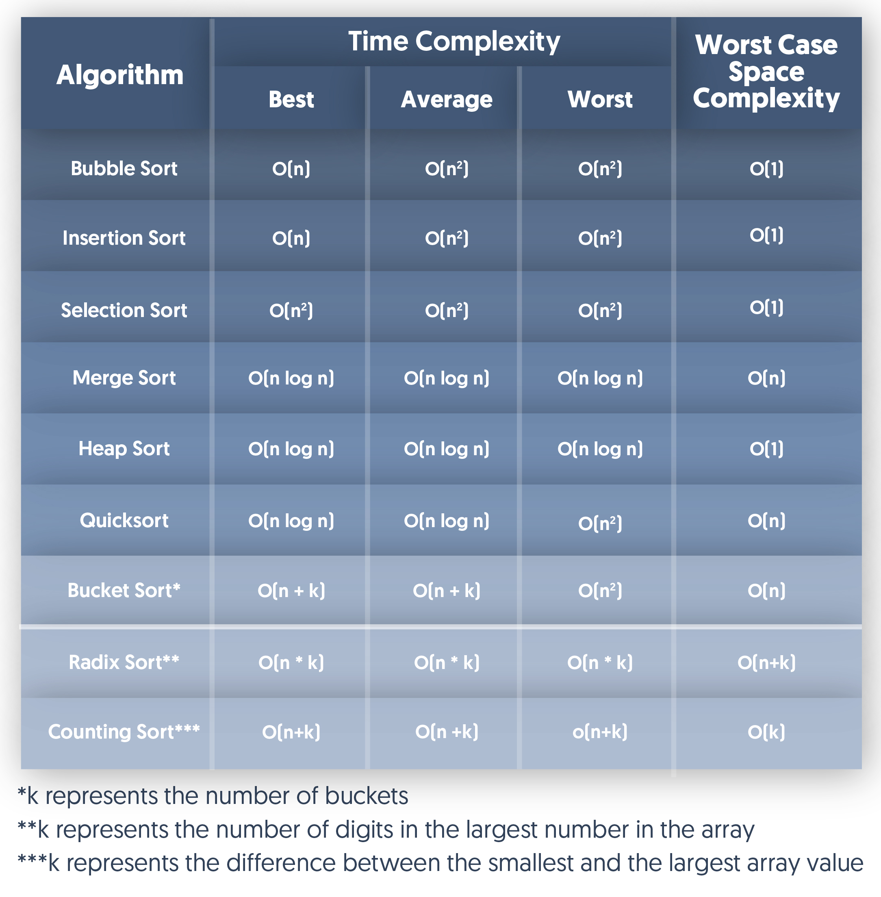

## 2.8 Space and time complexity ( My assigned part)
- **Time**:  time taken by the algorithm to execute each set of instructions. It is always better to select the most efficient algorithm when a simple problem can solve with different methods.

- **Space**: is usually referred to as the amount of memory consumed by the algorithm. It is composed of two different spaces; Auxiliary space and Input space.

## 2.9 Big O Notation

- **Def**: Big O notation (O) signifies an upper limit for f(n), representing the maximum growth rate.
- **Ex**: Functions like n2 and n3 fall within O(n2), while n and n2.9 are not within O(n3).
- **Used for**: Big O is used to describe the worst-case scenario in algorithms, outlining their upper performance bounds.

## 2.10 Omega Notation

- **Def**: Omega notation (Ω) provides a tight lower bound for f(n), indicating the minimum performance level.
- **Ex**: Functions in Ω(n2) include n2 and n3, while those not in Ω(n3) include n and n2.9.

## 2.11 Theta Notation

Certainly, here are a few key points about Theta notation:

- Theta notation (θ(g(n))) provides a tight bound on the growth rate of a function.
- It signifies that a function grows at the same rate as another function within constant factors.
- Formally, f(n) in θ(g(n)) if there exist positive constants c1, c2, and n1 such that 0 <= c1 * g(n) <= f(n) <= c2 * g(n) for all  n >= n0.
- Theta notation is used to describe functions where both the upper and lower bounds are asymptotically tight.
- It provides a more precise description of the growth rate compared to Big O or Big Omega notation alone.

## 2.12
### Little O Notation

Little O notation is a way to describe how fast a function grows compared to another function. When we say 

### Little Omega Notation

Little Omega notation (ω(g(n))) represents a loose lower bound that is not asymptotically tight. In simpler terms, it says that a function f(n) grows at least as fast as another function g(n) as n gets infinitely large. However, it doesn't specify exactly how much faster.