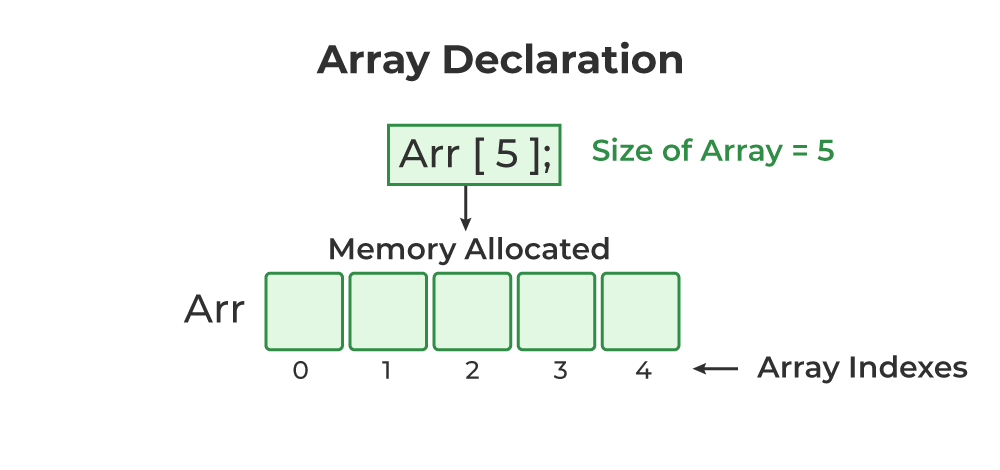
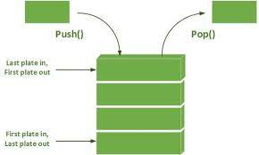

## primitive vs. non-primitive data structures:
-   Primitives are the basic data types like numbers and characters, while non-primitives are more complex and are built using primitive data structures which allow poeple to organize and store data in a more sophisticated way.
## linear vs. non-linear data structures
-  Linear data structures are like a straight line. Elements are arranged in a sequential order, and you go through them one by one. Non linear data structures can have multiple paths or connections, doesn't have to be linear. 
## Array
- An array is a collection of similar data elements. The elements of the array are stored in consecutive memory locations and are referenced by an
index (also known as the subscript). 
- In C, arrays are declared using the following syntax:
type name[size];
- The array index starts
from zero.

```python
// C Program to illustrate the array declaration
#include <stdio.h>

int main()
{

	// declaring array of integers
	int arr_int[5];
	// declaring array of characters
	char arr_char[5];

	return 0;
}
``````
## linked lists
-  A linked list is a collection of nodes where each node contains data as well as the memory address of the next node in the list.
- Even though the nodes are not in a contiguous memory, the nodes are stored linearly through links
- A node in a linked list consists of two parts:
    - Data which denotes the value of the node.
    - Next which is a reference to the succeeding node.
    
```python
    // A Single linked list node 
struct Node { 
    int data; 
    struct Node* next; 
};
``````
- Common operations on linked lists include inserting a node, deleting a node, traversing the list, and searching for a specific value.
## stacks
- A linear data structure with Last-In-First-Out (LIFO) access, supporting operations like push and pop.
-  Stack is called a last-in, first-out (LIFO) structure because
the last element which is added to the stack is the first element which is deleted from the stack

## queues
-  A linear data structure with First-In-First-Out (FIFO) access, supporting operations like enqueue and dequeue.
## trees
- A non-linear data structure composed of nodes connected by edges, with one designated as the root, allowing hierarchical representation.
## graphs
-  non-linear data structure comprising vertices connected by edges, representing relationships between objects.
## traversing
- Process of accessing and visiting all elements of a data structure in a specific order.
## searching
- Process of finding a target element within a data structure.
## inserting / deleting
- Operations to add or remove elements from a data structure.
## sorting
- Process of arranging elements in a specific order such as ascending or descending.
## merging
- Combining two or more data structures into a single structure while maintaining its properties.